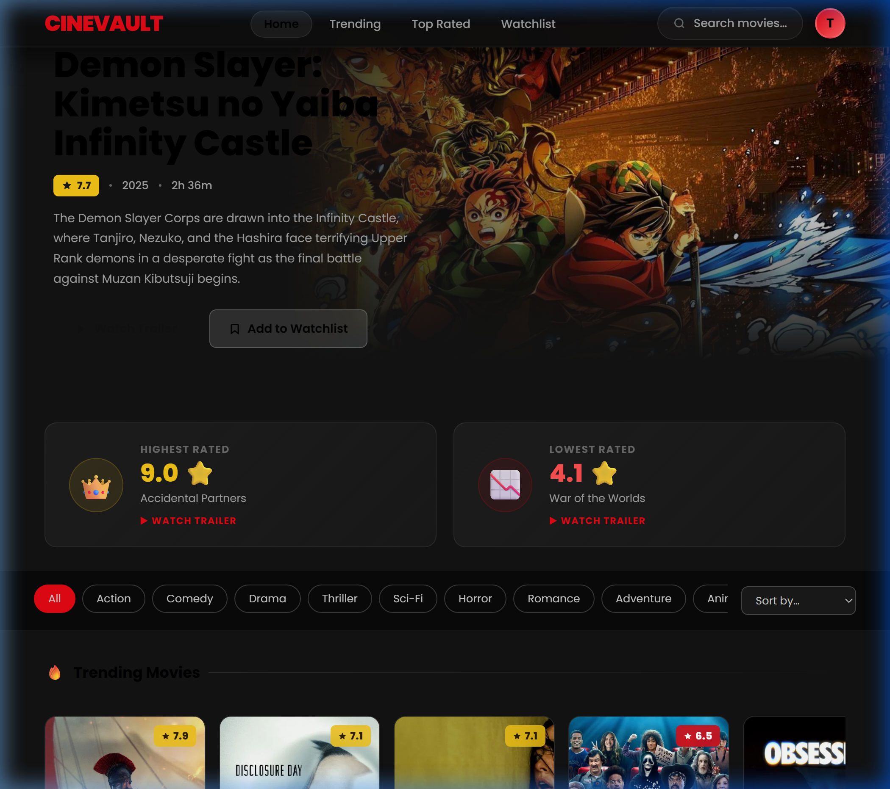
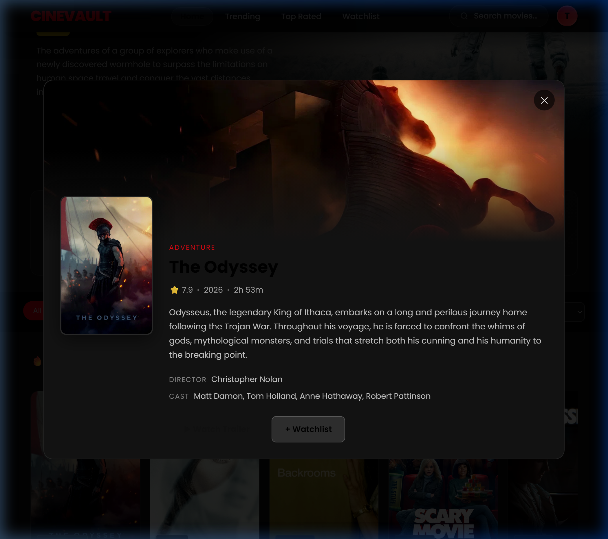
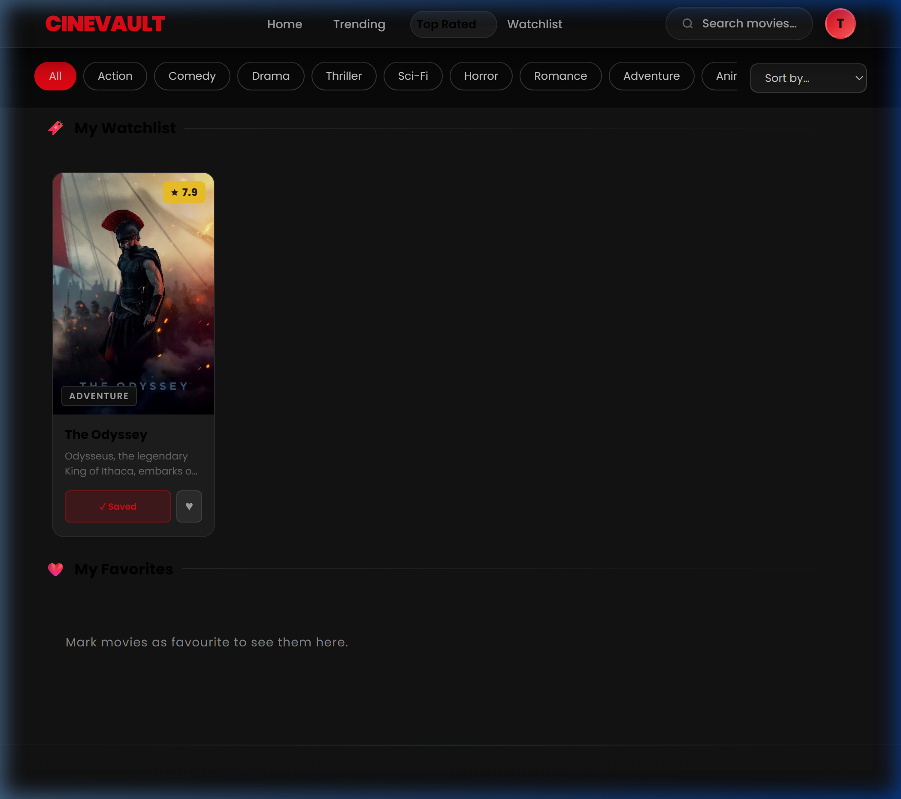

# 🎬 CineVault

A Netflix-style movie discovery and watchlist app built with vanilla JavaScript — real-time TMDB data, Firebase authentication, and a Firestore-backed per-user watchlist, favorites, and viewing history.

**[Live Demo →](https://cinevault-movies.netlify.app/)**



<p align="center">
  
  
</p>

## Features
- 🔍 Live search with debounced queries and stale-response protection
- 🎭 Genre filtering and multi-field sorting across trending/top-rated/genre rows
- 📽️ Movie details modal with trailer playback, cached director/cast/runtime lookups
- 🔐 Firebase Authentication — guests can browse freely; login is only required to save a watchlist, favorites, or viewing history
- ☁️ Per-user data synced to Firestore, isolated by account
- ♿ Accessibility: focus-trapped modal, aria-labeled controls

## Tech Stack
**Frontend:** Vanilla HTML5, CSS3, JavaScript (ES6 Modules) — no framework, no build step  
**Data:** [TMDB API](https://www.themoviedb.org/documentation/api) for movie data  
**Auth & Database:** Firebase Authentication + Cloud Firestore  
**Hosting:** Netlify  

## Architecture
- **`index.html`** — Main entry markup document.
- **`style.css`** (located at `assets/css/style.css`) — Global style declarations.
- **`config.js`** *(gitignored)* — Holds client-side keys for TMDB API (example config template provided as `config.example.js`).
- **`js/firebase-config.js`** *(gitignored)* — Firebase initialize configurations (example config template provided as `js/firebase-config.example.js`).
- **`js/api.js`** → TMDB fetch calls, response mapping, in-memory details cache.
- **`js/auth.js`** → Firebase Authentication wrapper (signup/login/logout).
- **`js/state.js`** → App state, Firestore read/write helpers.
- **`js/render.js`** → DOM building, modal logic, focus trap, filtering/sorting.
- **`js/main.js`** → Entry point — event wiring, auth flow orchestration.

*Note: All modules and files have been organized under the `/assets/` directory (e.g. `assets/js/` and `assets/css/`) to optimize folder structure for GitHub, while duplicate templates have been kept at the legacy root pathways to support older setups.*

## Setup
1. Clone this repo
2. Copy `config.example.js` → `config.js` and add your own [TMDB API key](https://www.themoviedb.org/settings/api)
3. Copy `js/firebase-config.example.js` → `js/firebase-config.js` and add your own Firebase project config (create a free project at [firebase.google.com](https://firebase.google.com), enable Authentication (Email/Password) and Firestore)
4. Open `index.html` via a local server (e.g. VS Code Live Server) — ES modules require serving over http, not opening the file directly
5. Firestore security rules used in this project (add these in your own Firebase console under Firestore → Rules):

```javascript
rules_version = '2';
service cloud.firestore {
  match /databases/{database}/documents {
    match /users/{userId} {
      allow read, write: if request.auth != null && request.auth.uid == userId;
    }
  }
}
```

## Known Limitations
- No pagination — each category row shows TMDB's first 20 results
- No request retry/timeout handling on network failure
- Username uniqueness isn't enforced (display name only, not a login identifier)

## License
MIT
